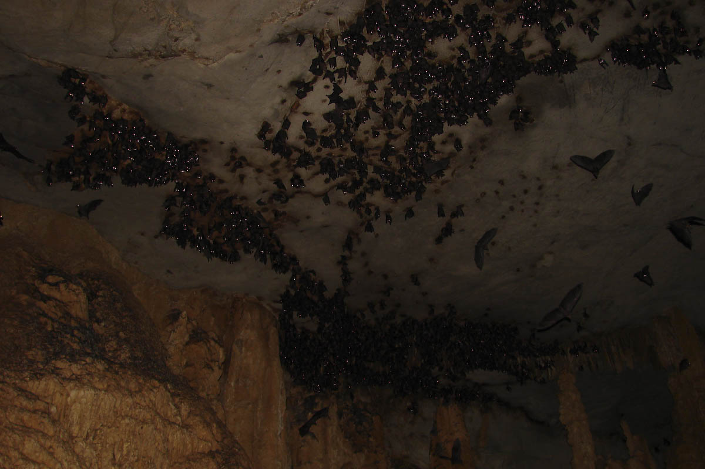

# batcave
sets up my batcave aka environment

## install
* `make deps`: installs ansible through pipsi
* `make install`: installs and configurates zsh, vim, tmux and git
* `make x11`: installs and configurates the base stuff plus i3, xresources and screenlayouts
* `make nvim`: installs neovim
* `make all`: install and configurate base, x11 and neovim
* `make update`: update repo
